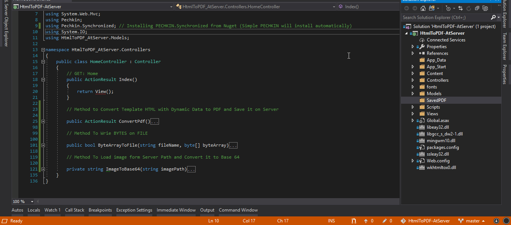

# CSharpModule-HtmlToPDF-AtServer 👏

## Saving HTML to PDF on server Folder with conversion of Images to Base64 and with Dynamic Data, using PECHKIN Library.

Thanks To [PECHKIN](https://github.com/gmanny/Pechkin) Library. Install [Pechkin.Sychronized](https://www.nuget.org/packages/Pechkin.Synchronized/) from nuGet & Save your HTML to PDF.

📑💫💻

## "Proper Comments for Understanding & Readable Easy Code! "Written Separately!" 🤟🤟🤟

---

## Demo in Motion <u>**(Saving PDF to Server Folder)**</u>: 😉

---

## 📄 License 🔐

CSharpModule-HtmlToPDF-AtServer (Saving HTML to PDF on server Folder)
Copyright (C) 2019 - Arslan Ameer

This program is free software: you can redistribute it and/or modify
it under the terms of the GNU General Public License as published by
the Free Software Foundation, either version 3 of the License, or
(at your option) any later version.

This program is distributed in the hope that it will be useful,
but WITHOUT ANY WARRANTY; without even the implied warranty of
MERCHANTABILITY or FITNESS FOR A PARTICULAR PURPOSE. See the
GNU General Public License for more details.

You should have received a copy of the GNU General Public License
along with this program. If not, see <http://www.gnu.org/licenses/>
